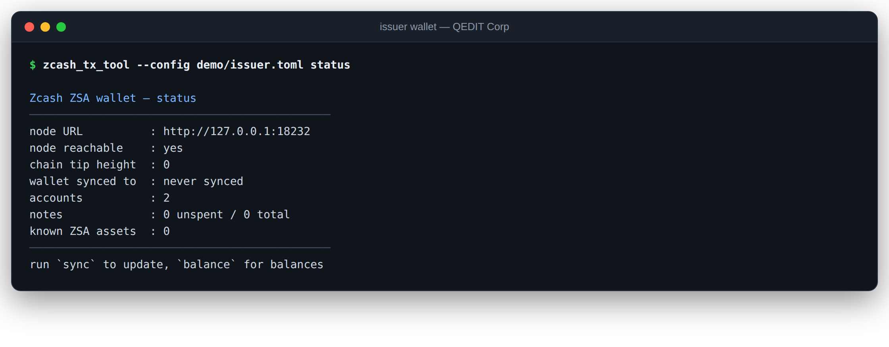
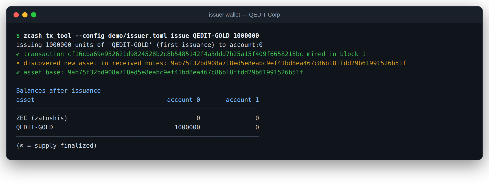
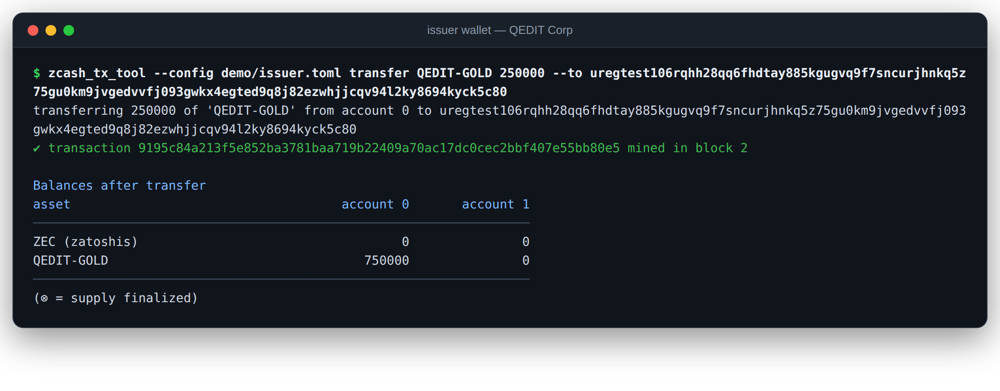
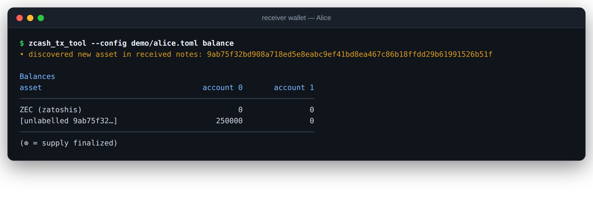
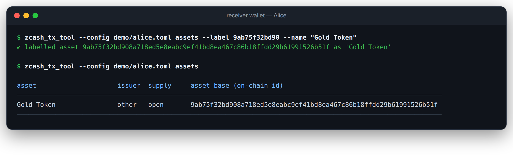
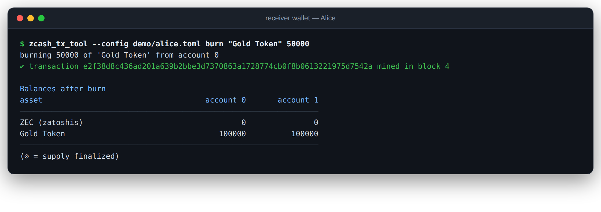
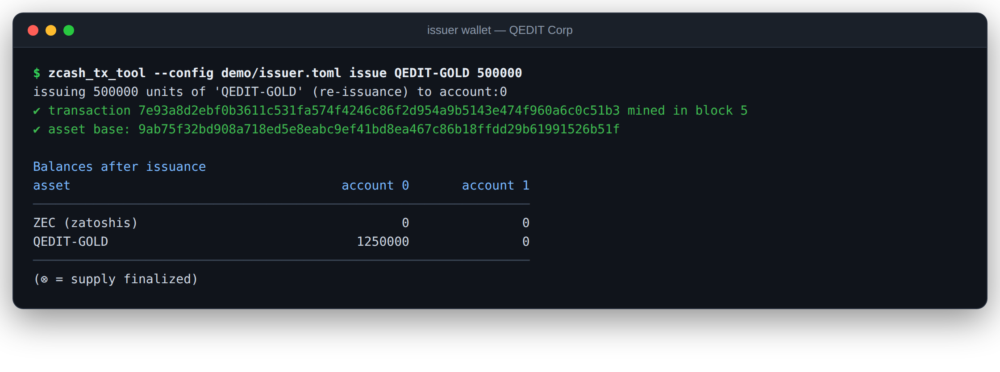
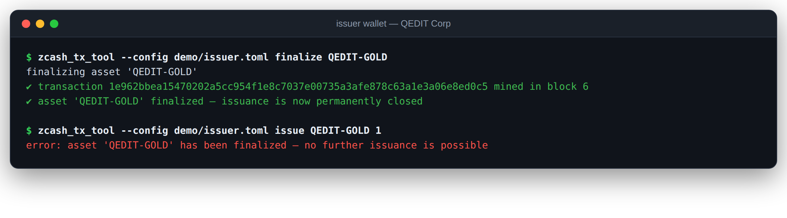
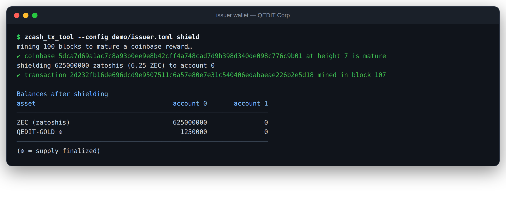
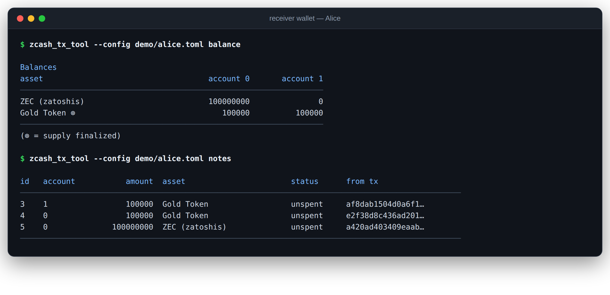

# From Test Harness to Wallet: Driving the Full Zcash Shielded Assets Lifecycle from the Command Line

*QEDIT engineering*

For the past few years, QEDIT has been building the **Zcash Shielded Assets (ZSA)** protocol — the upgrade that brings multi-asset support to Zcash's shielded Orchard pool, specified in [ZIP 226](https://zips.z.cash/zip-0226) (transfer and burn), [ZIP 227](https://zips.z.cash/zip-0227) (issuance), and [ZIP 230](https://zips.z.cash/zip-0230) (the V6 transaction format). Along the way we maintained [`zcash_tx_tool`](https://github.com/QED-it/zcash_tx_tool), a Rust program whose job was to hammer our ZSA-enabled [Zebra](https://github.com/QED-it/zebra) node with end-to-end scenarios: issue an asset, pass it around, burn it, finalize it, and assert that every balance lands exactly where the protocol says it should.

That test harness has now grown into something more interesting: **a working command-line wallet for Zcash Shielded Assets**. Same codebase, same battle-tested transaction logic that runs in our CI against every commit — now exposed as a set of wallet commands that manage notes, track assets, and let you *issue, transfer, burn and finalize* shielded assets against a live node.

This post walks through the wallet and a complete two-party demo on a regtest network: a fresh chain, an issuer, a receiver, one asset lifecycle from birth to finalization — with real screenshots at every step.

## Why a CLI wallet matters

A protocol is only as real as the software that exercises it. For ZSA, the interesting flows are *multi-party*: an issuer mints an asset and sends it to someone whose wallet has never heard of that asset before. That receiving wallet must:

- **detect** the incoming note by trial-decrypting every transaction on chain,
- **track** the note in a local database along with its position in the global note commitment tree,
- **recognize** a brand-new asset identifier it has never seen, and account for it separately from ZEC and every other asset,
- **spend** the note later — building a zero-knowledge proof against the current anchor — to transfer or burn it.

Our end-to-end tests did all of this internally, but only in fixed, single-process scenarios. Turning the same components into a wallet CLI makes the flows available to *people*: protocol engineers reproducing an issue, integrators prototyping against the ZSA testnet, or anyone who wants to feel what shielded multi-asset UX is like at the lowest level.

## What the wallet does

The wallet keeps the tool's existing architecture — a `Wallet` component managing keys, notes and the Orchard commitment tree (persisted in SQLite via Diesel), a transaction builder wrapping QED-it's fork of [librustzcash](https://github.com/QED-it/librustzcash), and a JSON-RPC client speaking to Zebra. What's new is the interface and the bookkeeping around it:

| Command | What it does |
| --- | --- |
| `status`, `sync`, `addresses`, `balance`, `notes` | Wallet state: sync with the node, list addresses (unified + raw), balances per asset × account, individual notes |
| `assets` | Local **asset registry**: your own assets with full metadata, received assets discovered automatically (labelable) |
| `issue <desc> <amount>` | Create a new shielded asset, or raise the supply of one you already issued |
| `transfer <asset> <amount> --to <addr>` | Send asset units (or ZEC) to any Orchard address, shielded end-to-end |
| `burn <asset> <amount>` | Provably destroy units, reducing supply |
| `finalize <asset>` | Permanently close an asset's supply (ZIP 227 finalization) |
| `shield`, `mine` | Regtest utilities: mature + shield a coinbase reward; produce blocks |

Multiple wallets — separate seed phrases, separate note databases — run side by side against one node, each seeing only what its keys can decrypt.

## The demo

Everything below ran unedited against a fresh regtest chain: a ZSA-enabled Zebra node (QED-it's `zsa-integration-demo` branch) with NU7 activated at height 1, and two wallet configurations — the **issuer** ("QEDIT Corp") and **Alice**. Every screenshot is the actual terminal output of the listed command.

### 1. A fresh start

The chain is at height 0; the issuer's wallet has never synced, holds nothing, and knows no assets.



### 2. Issue a shielded asset

The issuer creates **QEDIT-GOLD** with an initial supply of 1,000,000 units. Under ZIP 227 the asset's identity (its *AssetBase*, the `9ab75f32…` value below) is derived from the issuer's issuance validating key together with the hash of the asset description — so only the holder of the issuance key can ever issue this asset. The wallet builds the V6 issuance transaction, gets it into block 1, syncs, and the new supply appears in its balance table.



### 3. Transfer to Alice — shielded

The issuer sends 250,000 units to Alice's unified address. The transaction reveals nothing on-chain about the asset type, the amount, or the parties — it is a standard Orchard-ZSA transfer inside the shielded pool.



### 4. Alice discovers the asset

Alice syncs. Her wallet trial-decrypts the chain, finds a note addressed to her, and records an asset it has never seen. This is the ZSA privacy model at work: **she knows exactly what she holds and how much — identified by the asset's on-chain id — while the network learns nothing.** The asset description string itself never appears on chain; issuers distribute it (and anyone can verify it against the AssetBase) out of band.



Alice attaches her own label to the discovered asset for bookkeeping:



### 5. Alice spends and burns

Received ZSA notes are fully spendable. Alice pays 100,000 units to her second account, then **burns** 50,000 — a ZIP 226 burn that provably destroys the units and reduces the asset's circulating supply, visible to the issuer and any auditor of total supply, without revealing who burned.



### 6. The issuer raises supply — then closes it forever

Supply management is an issuer capability with public accountability. First, the issuer issues 500,000 more units (total minted: 1,500,000):



Then the issuer **finalizes** the asset. Finalization is carried in the issuance bundle and enforced by consensus: after this block, no transaction can ever mint another unit of QEDIT-GOLD. The wallet enforces it too — and every other wallet on the network learns the supply is closed, because finalization is public:



### 7. Native ZEC, same wallet

ZSA lives alongside ZEC in the same Orchard pool, and the wallet treats ZEC as just another asset row. On regtest it can mature and shield a coinbase reward, then pay Alice 1 ZEC shielded:



### 8. The final ledger

Alice ends the demo holding 200,000 Gold Tokens split across two accounts plus 1 ZEC; the issuer holds the remaining 1,250,000. Total circulating supply: 1,450,000 — precisely 1,500,000 minted minus 50,000 burned, with every intermediate step enforced by consensus and verified by both wallets independently.



## What this demonstrates about ZSA

- **Shielded by default, multi-asset by design.** Issuance is the only public event (the supply of an asset is auditable); transfers and holdings are private, and burns reveal the amount destroyed but not the burner.
- **Asset identity is cryptographic.** An asset is *defined* by (issuance key, description hash). Nobody can mint an asset they don't own the key for, and receivers can verify a claimed description against the on-chain id.
- **Supply is controlled and provable.** Issuers can raise supply while it's open, and permanently close it with an on-chain finalization every wallet observes.
- **It runs today.** Everything above is the in-development NU7/V6 stack: QED-it's Zebra fork validating consensus, `orchard` and `librustzcash` forks building proofs, and this wallet driving them over JSON-RPC.

## Under the hood, honestly

This is alpha software for regtest and testnet experimentation — a development wallet, not a product. A few implementation notes for the technically curious:

- **The wallet is the miner (on regtest).** Transactions are placed directly into blocks the wallet assembles via `getblocktemplate`/`submitblock` — the same mechanism our CI uses. Zebra's regtest has proof-of-work disabled, so blocks are accepted immediately. Mempool submission (`--mempool`) exists, but the wallet currently builds zero-fee transactions, which node mempool *policy* (ZIP 317's unpaid-action limit) rejects even though consensus accepts them in blocks. Proper ZIP 317 fee support is on the roadmap.
- **Notes and tree state persist.** SQLite stores notes, block hashes and the serialized commitment tree; wallets resume incrementally, detect reorgs, and can rebuild from a full rescan (`clean` + `sync`) — the demo's receiving wallet was rebuilt from scratch mid-development and recovered every note and even the asset's finalization status from chain data alone.
- **Same code as the tests.** The wallet commands are thin shells over the exact components (`components::wallet`, `components::transactions`) the end-to-end scenarios exercise in CI on every commit. There is no separate "wallet logic" to drift out of sync with the tested paths.

## Try it yourself

```bash
# 1. Run the ZSA-enabled Zebra regtest node
git clone -b zsa-integration-demo --single-branch https://github.com/QED-it/zebra.git
cd zebra
docker build -t qedit/zebra-regtest-txv6 -f testnet-single-node-deploy/dockerfile .
docker run -p 18232:18232 qedit/zebra-regtest-txv6

# 2. Build the wallet
git clone https://github.com/QED-it/zcash_tx_tool.git
cd zcash_tx_tool
DATABASE_URL=walletdb.sqlite diesel setup   # after: cargo install diesel_cli --no-default-features --features sqlite
./zcutil/fetch-params.sh
cargo build --release

# 3. Run the full two-party demo
./demo/run_demo.sh

# ...or drive it yourself
./target/release/zcash_tx_tool --config demo/issuer.toml issue "MY-TOKEN" 1000
./target/release/zcash_tx_tool --config demo/issuer.toml balance
```

The demo script, both wallet configurations, and all documentation are in the [`zcash_tx_tool` repository](https://github.com/QED-it/zcash_tx_tool). For the public ZSA testnet endpoints, see the [project wiki](https://github.com/QED-it/zcash_tx_tool/wiki/Running-tx%E2%80%90tool).

---

*ZSA is developed by QEDIT with support from the Zcash community, in collaboration with the Electric Coin Company, the Zcash Foundation, and the Zebra team. The ZIPs: [226](https://zips.z.cash/zip-0226), [227](https://zips.z.cash/zip-0227), [230](https://zips.z.cash/zip-0230).*
